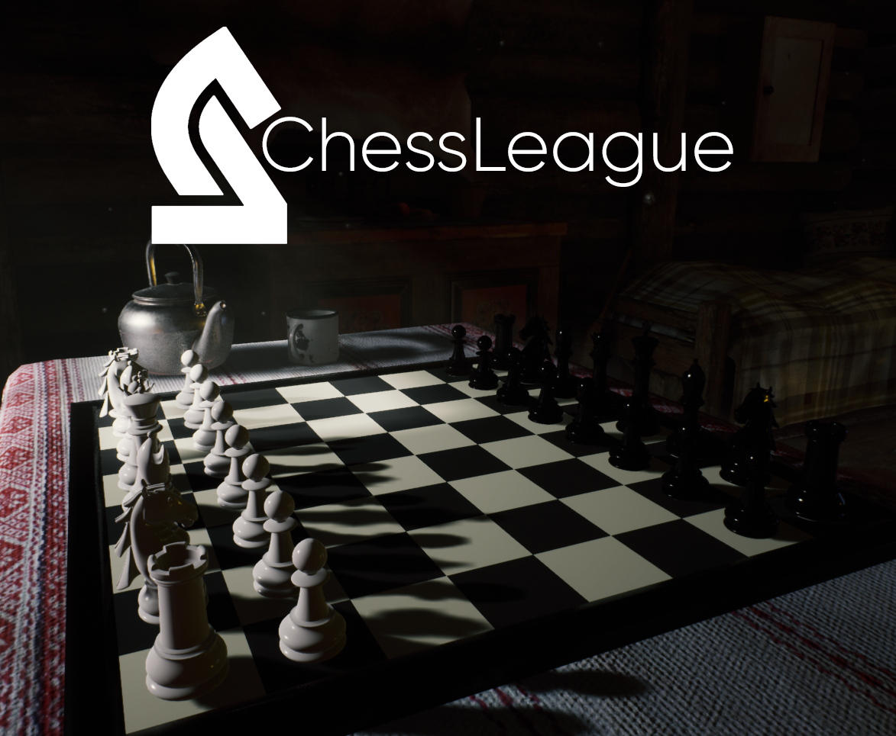
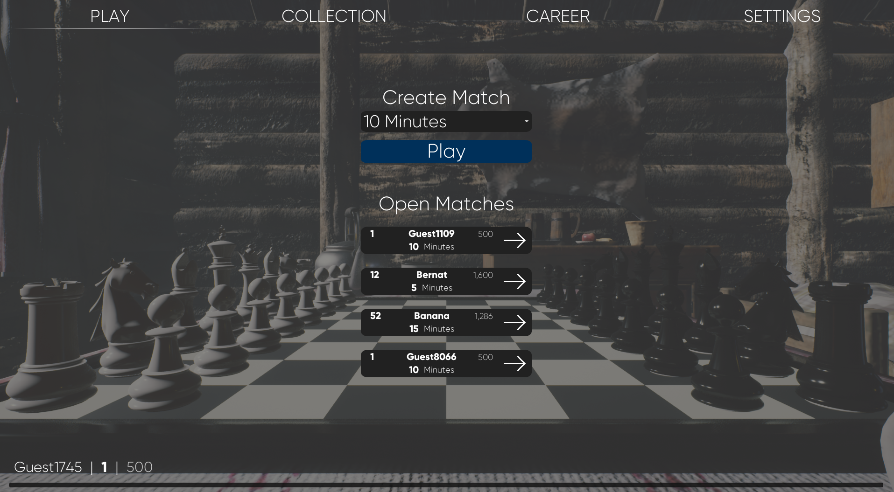
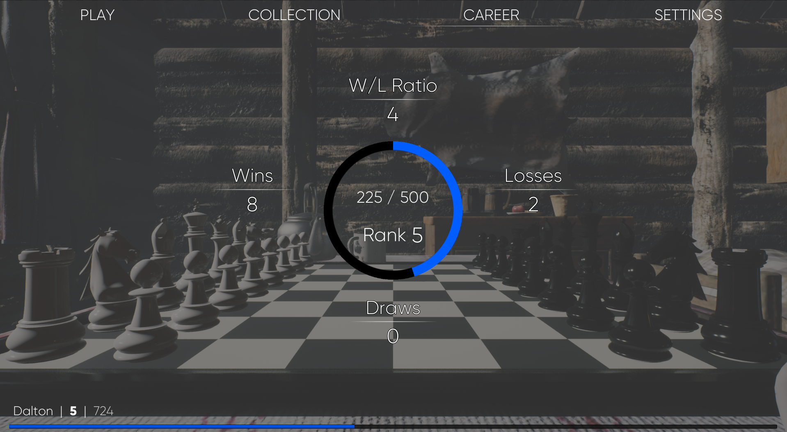
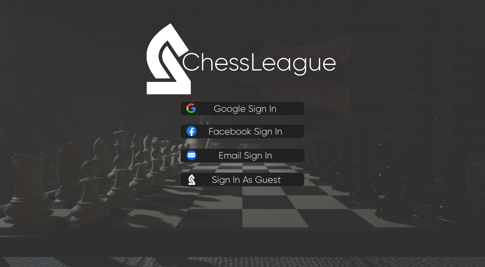

# ♟️ChessLeague♟️
ChessLeague is an cross-platform multiplayer chess game set in a beautiful 3D environment. The app was built during my time at Codeworks as a solo project.

As an avid gamer, I'm frustrated by the lack of a sleek, modern versions of board games that do not utilize the capabilities of most modern gaming devices. 
Many of the leading online chess games are still 2D and very basic in nature. Since chess in itself is not as complex relative to other types of online games, 
I felt that I could mock up a beautiful 3d environment, program the algorithms required for the chess logic, and add in networking done through an express server and nodeJS... all in a weeks time!

## Features

### View & Start Chess Games, Matchmaking Across Platforms

Users can browse the game posts that are broadcast by other players looking for a game.

### View Profile Stats, Change Settings, Unlock Content

Users can:

- View their career stats, and account level progress in an easy to read manner
- They can alter their settings to their liking
- View any owned or unlocked content that will customize their game

### Sign Up & Authentication to Registered Account or as Guest

Users have multiple sign in and sign up options. The key for a casual
game like this is to make it as low friction as possbile to get 
people playing.

## Getting Started
Frontend   
- The frontend and game logic was built in UE4. Only the backend server & database logic is hosted here on GitHub
- If you would like to download the full UE4 project files, please contact me and I can give you a google drive link.
- Once UE4 project is downloaded, there is a master switch variable in Content/BPs/Controller_Player to switch to local endpoints. 
- Press play with dedicated server option ticked
Backend   
- Fork the repository and clone it on your local machine
- Install the dependencies by running `npm i` in the server directory
- Start the server with nodemon command `nodemon index.js`
- Endpoints can be tested with Postman

## Tech Stack

- [Unreal Engine 4](https://www.unrealengine.com/en-US/)
- [Unreal Engine Plugin- LE HTTP Requests](https://www.unrealengine.com/marketplace/en-US/product/low-entry-http-request)
- [Unreal Engine Plugin- Socket.IO Client](https://www.unrealengine.com/marketplace/en-US/product/socket-io-client)
- [NodeJS](https://nodejs.org/en/)
- [ExpressJS](https://expressjs.com/)
- [Socket.io](https://socket.io/)
- [MongoDB](https://www.mongodb.com/)
- [MongooseJS](https://mongoosejs.com/)
- REST API

## Future Plans

This project was initially thrown together in a mad flurry because of how much I had to get done in just 10 days. I would like 
to first clean up the backend, clean up the algorithm helper functions on the frontend. Once everything is clean and refactored, 
I would like to begin adding some new features   
- Improve authentication system to include OAuth low friction sign in
- Refactor all matchmaking and in game communication to server to socket.io
- Refresh available matches in regular interval
- Add in additional UI and improve styling
- Improve end of match recap UI
- Add in match history section where players can review 2d recaps of the games
- Store match history in neat and orderly fasion in the mongoDB

